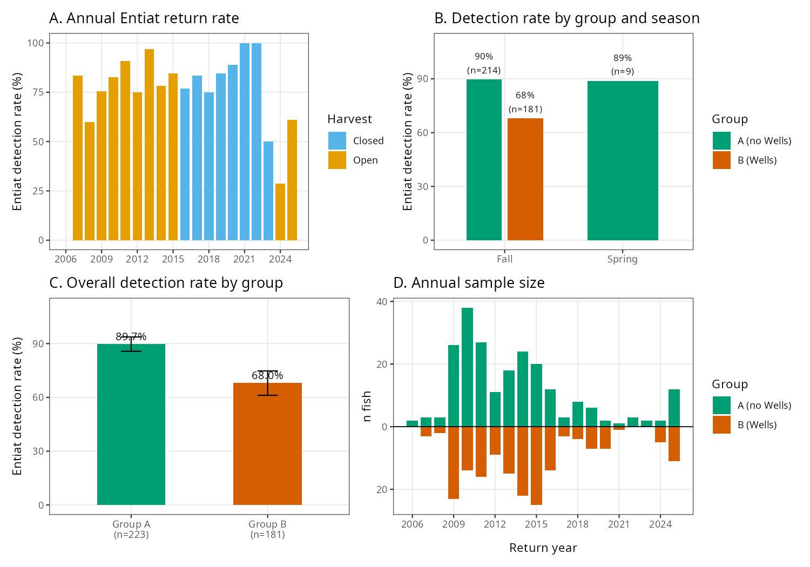
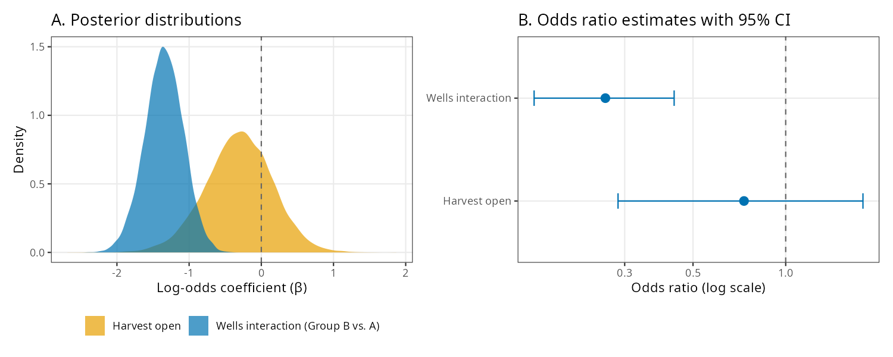
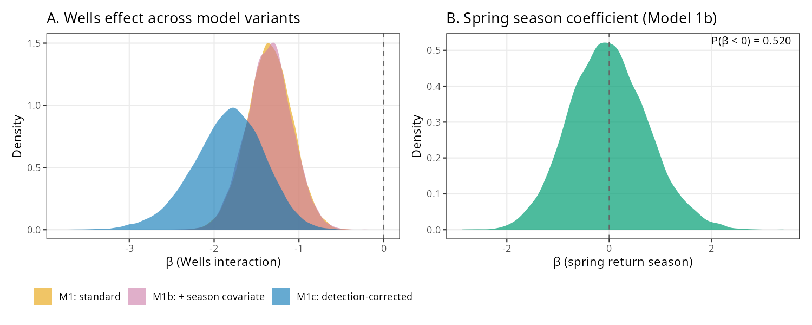
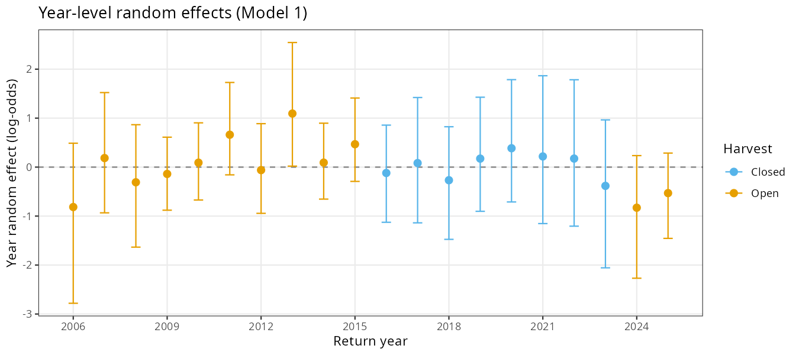
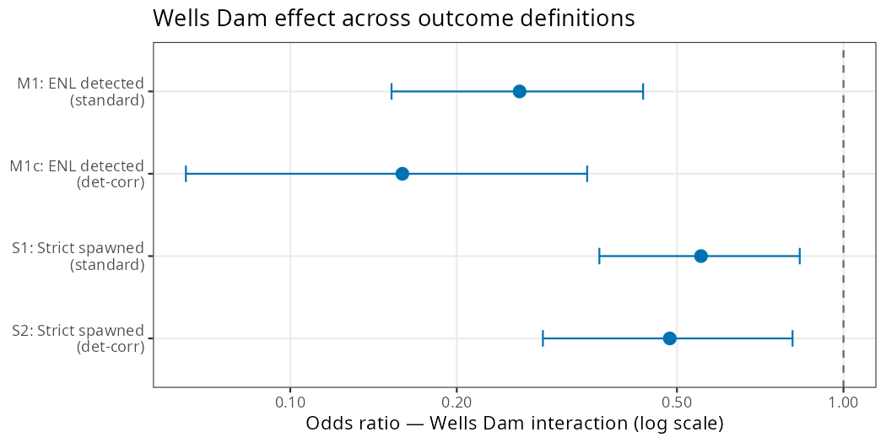

**Prepared by:**

**Public Utility District No. 1 of Douglas County**

East Wenatchee, Washington

April 2026

# Abstract

Wild summer steelhead (*Oncorhynchus mykiss*) returning to the Entiat River have been observed overshooting their natal tributary and ascending the fish ladders at Wells Dam (river kilometer 830). Whether this overshoot behavior reduces subsequent probability of return to the Entiat River subbasin has not been formally evaluated. Using PIT-tag detection data from 404 wild Entiat-origin steelhead detected above Rocky Reach Dam across return years 2006--2025, we employed Bayesian hierarchical logistic regression to test whether interaction with Wells Dam, harvest status (open vs. closed years), spring return timing, and spill conditions at Wells Dam predict whether a fish is subsequently detected in the Entiat River subbasin. Fish were classified into Group A (no Wells Dam detection post-adult Rocky Reach passage; n = 223) and Group B (Wells Dam interaction, excluding confirmed strays; n = 181). All Group B fish were fall returners. Group A fish were detected in the Entiat River 89.7% of the time compared to 68.0% for Group B---a 21.7 percentage-point gap. The Bayesian hierarchical model estimated an odds ratio of 0.260 (95% CI: 0.153--0.434) for the Wells Dam interaction, with posterior probability of a negative effect of 1.000. A compound-detection-likelihood model incorporating per-fish ENL detection efficiency yielded a stronger estimate (OR = 0.160; 95% CI: 0.065--0.344; P(β < 0) = 1.000). A sensitivity analysis using a strict spawning outcome---requiring detection at ENL and at least one upstream Entiat site within 18 months---yielded Group A = 60.1% and Group B = 47.5%, with the detection-corrected model estimating OR = 0.485 (95% CI: 0.286--0.813; P(β < 0) = 0.997). The true effect on spawning success likely falls between these bounds. Among Group B fish (Model 2; n = 181), fall spill hours showed a suggestive positive association with Entiat return probability (OR = 1.33; 95% CI: 0.93--1.97; P(β > 0) = 0.938), though the credible interval spans zero. Spring spill showed a similar trend (OR = 1.24; P(β > 0) = 0.843). These findings indicate that wild Entiat steelhead that overshoot to Wells Dam have roughly one-quarter to one-half the odds of being detected returning to the Entiat River, an effect consistent across seasons and dam operating conditions, with direct implications for ESA recovery planning.

*Keywords: steelhead, overshoot, natal homing, PIT tag, Bayesian hierarchical model, Wells Dam, Entiat River, Columbia River*

# Introduction

## Conservation Significance

Upper Columbia River steelhead are listed as threatened under the Endangered Species Act (ESA), having been originally listed as endangered in 1997 and reclassified to threatened in 2006 (NOAA Fisheries 2024). The Entiat River supports a genetically distinct wild steelhead population within this distinct population segment (DPS). Wells Dam, owned and operated by Public Utility District No. 1 of Douglas County, is located on the mainstem Columbia River approximately 31 river miles upstream of the Entiat River confluence and is the uppermost dam with fish passage facilities on the mainstem Columbia. Any Entiat-origin fish detected at Wells Dam has already passed its natal tributary confluence, making detection there definitionally an overshoot event. Understanding what proportion of these overshoot fish successfully return to the Entiat River---and what factors influence that probability---is directly relevant to recovery planning and hydroelectric project licensing under the Wells Habitat Conservation Plan and Anadromous Fish Agreement.

## Steelhead Overshoot Behavior

Most anadromous salmonids exhibit strong natal homing fidelity, returning to their birth streams to spawn following a marine phase. However, "overshooting" occurs when adult fish migrate upstream past their natal tributary, sometimes passing one or more hydroelectric projects, before attempting to fall back downstream to spawn (Keefer and Caudill 2014; Richins and Skalski 2018). Some steelhead populations exhibit overshoot rates exceeding 50--60% (Richins and Skalski 2018; Murdoch et al. 2022; Min et al. 2025). Temperature is among the best-documented drivers: Richins and Skalski (2018) found the probability of direct natal stream entry declined from >90% to <25% as temperatures rose from 10°C to 20°C, consistent with fish seeking coldwater thermal refugia upstream of natal locations during warm summer conditions.

What proportion of overshooting fish subsequently return to natal streams is uncertain. Murdoch et al. (2022) estimated that approximately 40% of wild steelhead overshoots at Priest Rapids Dam fail to return downstream. Non-return mechanisms include permanent stray behavior, failure to navigate downstream passage routes, mortality during turbine or spillway passage, overwinter mortality, harvest mortality, and predation. These mechanisms are difficult to disentangle with PIT-tag data alone. Min et al. (2025) examined 20 years of PIT-tag data for 37 Columbia River steelhead populations and found that late-winter spill improved return rates only for the Walla Walla and Tucannon River populations; Entiat River steelhead did not benefit from greater late-winter spill at Wells Dam.

## Detection Efficiency Considerations

Interpreting PIT-tag-based detection rates requires careful attention to antenna detection efficiency, which varies by season and discharge. The lower Entiat River antenna (ENL) has lower detection probability during high-discharge periods. We addressed this directly by: (1) characterizing the seasonal distribution of returns for each group; (2) computing within-season detection rates for Group A and Group B; (3) fitting a robustness model that includes spring return timing as an explicit covariate; and (4) fitting a compound Bernoulli likelihood model, Y~i~ \~ Bernoulli(θ~i~ × p~ENL,i~), in which per-fish detection efficiency p~ENL,i~ was estimated from a Bayesian hierarchical flow model of ENL detection data.

## Study Objectives

This study tested the following primary hypothesis:

- **Wells Dam Interaction Hypothesis:** Wild Entiat steelhead detected at Wells Dam following adult Rocky Reach Dam passage have lower probability of subsequent detection in the Entiat River subbasin than fish that did not interact with Wells Dam.

Three secondary questions were also addressed:

- Does spring return timing (and associated lower ENL detection efficiency) explain the group difference in Entiat detection rates?
- Does annual harvest status (open vs. closed) influence Entiat return probability?
- Among Wells-interacting fish, do spill conditions at Wells Dam during the fall arrival window (August--November) or spring holding window (January--March) predict Entiat return probability?

We employed Bayesian hierarchical logistic regression to account for year-level variation in baseline return rates while appropriately quantifying uncertainty in effect estimates.

# Methods

## Study Area

The Entiat River is a tributary of the Columbia River with its confluence approximately 31 river miles downstream of Wells Dam (rkm 830). Adult steelhead returning to the Entiat must navigate eight mainstem Columbia River hydroelectric projects. Rocky Reach Dam (Chelan County PUD, rkm 806) is the dam immediately downstream of Wells Dam; fish detected at Rocky Reach adult fishway antennas in July--December are considered returning fall adults, with January--May detections representing spring-migrating adults that overwintered downstream. The PIT-tag detection network in the Entiat River basin is maintained by multiple partners including Bonneville Power Administration and includes the lower Entiat antenna (ENL, rkm 1--2) and monitoring throughout the subbasin.

## Data Sources

**Fish Detection Data:** PIT-tag detection records were obtained from PTAGIS (ptagis.org) for wild steelhead with Entiat River detection histories that included Rocky Reach adult fishway (RRF) detections. The dataset contained 4,131 detection rows representing 417 unique fish across return years 2006--2025. Each row represents one detection event at one site and includes site name, subbasin classification, and detection timestamps. Event timestamps were parsed using the M/D/YYYY H:MM format consistent with PTAGIS export conventions.

**Spill Data:** Hourly spill discharge measurements (kcfs) at Wells Dam were obtained from Columbia River DART and supplemented with 2024--2025 data provided by Douglas County PUD. Spill metrics were computed for the fall arrival window (August 1--November 30, assigned to the following return year) and spring holding window (January 1--March 31) for each return year. All 181 Group B fish had complete spill data.

**Harvest Status:** Annual harvest status was compiled from Washington Department of Fish and Wildlife regulations: harvest was open 2006--2015 and again in 2024--2025, and closed 2016--2023 due to low wild steelhead returns. All fish in this analysis are wild-origin, so the harvest covariate reflects year-level conditions.

## Adult Return Anchor Date

To exclude juvenile outmigrant detections at Rocky Reach, each fish was assigned an "adult RRF anchor date" defined as the first Rocky Reach adult fishway (RRF) detection in July--December. Only post-anchor detections were used for group assignment and outcome classification.

Fish with only January--May RRF detections (spring returners completing upstream migration following ocean return) were evaluated for inclusion. June-detected fish were assigned to spring or fall based on Priest Rapids Dam (PRA) detection timing: fish with PRA detections in the previous fall (August--December) or January--May of the same year were classified as spring (late spawners); fish with June PRA detections before their RRF detection were classified as fall (new migrants).

Two fish (3D9.1C2CDD70AD, 3D9.1C2D45A06D) had confirmed adult returns documented by Bonneville, McNary, Priest Rapids, and Rock Island adult ladder detections but were not detected at Rocky Reach adult fishway on their return migration. These fish were re-anchored to their Priest Rapids adult detection date (2011-09-17 and 2012-08-29, respectively) and their spawning outcomes were manually confirmed from Entiat subbasin detection records.

## Site Classifications

Detection sites were classified as follows:

- **Entiat River subbasin:** site prefixes ENL, ENA, ENM, ENS, ENF, MAD, RCT, TLT, URT, HN1--3, UMR, HS1--2, SR1--2, EHL
- **Wells Dam:** sites WEA, WEJ, or WEH
- **Upstream tributaries (stray indicator):** sites in Methow or Okanogan subbasins
- **Rocky Reach adult fishway:** site prefix RRF
- **Migration corridor:** site prefixes MC1, MC2, PRA, RIA

## Group Assignment

Fish were assigned to one of three categories based on post-anchor detection history:

- **Group A** (n = 223): No Wells Dam detection after the adult RRF anchor date.
- **Group B** (n = 181): Wells Dam detection after the anchor date, AND fish was NOT last detected in the Methow or Okanogan subbasin. Overshoot fish that did not stray permanently into upstream non-natal tributaries.
- **Excluded -- Strays:** Wells Dam detection after anchor, with last detection in the Methow or Okanogan subbasin. Presumed to have completed spawning in non-natal upstream tributaries.

## Outcome Definitions

### Original outcome: EntiatDetected

EntiatDetected = 1 if the fish had any post-anchor detection at an Entiat River subbasin site, 0 otherwise. No time restriction is imposed on the detection window.

### Strict outcome: EntiatSpawned

A more conservative outcome was defined to require evidence of reaching documented spawning habitat within 18 months of the RRF anchor:

- **Fall returners:** Detection at ENL (Lower Entiat River, rkm 1--2) AND at least one upstream Entiat site, both within 18 months of anchor
- **Spring returners:** Detection at ENL alone within 18 months of anchor (spring fish may spawn in the lower Entiat reach below ENM)

ENL is at the mouth of the Entiat River with no spawning habitat below it. Fall fish detected at ENL but never at upstream sites likely represent brief or incomplete entry events and are scored as EntiatSpawned = 0.

## Data Quality

Release-date checks (age at anchor = days from tagging to RRF anchor / 365.25) identified three fish with anomalous detection histories. All three were reviewed against full PTAGIS detection records and retained with corrections:

- **3D9.1C2C451B01** — Valid 2009 fall return (age at anchor 1.35 yr). A single 2017 ENS detection confirmed as a data error was excluded; EntiatDetected = 0, EntiatSpawned = 0.
- **3D9.1C2CDD70AD** — Tagged as a juvenile smolt (RRJ juvenile bypass detection spring 2010). Confirmed 2011 adult return via BON → MCN → PRA → RIA → ENL September 2011; upstream Entiat detections spring 2012 (within 18-month window). Re-anchored to PRA 2011-09-17; EntiatSpawned = 1.
- **3D9.1C2D45A06D** — Tagged at ENL as juvenile. Confirmed 2012 adult return via BON → MCN → PRA → RIA; MAD/TLT/ENA detections spring 2013; post-spawn kelt confirmed at RRJ April 2013. Re-anchored to PRA 2012-08-29; EntiatSpawned = 1.

## Predictor Variables

**wells_interaction:** Binary; 1 = Group B, 0 = Group A.

**harvest_open:** Binary year-level indicator; 1 = open harvest year (2006--2015, 2024--2025), 0 = closed harvest year (2016--2023).

**spring_return:** Binary; 1 = anchor date in January--May, 0 = July--December.

**Spill metrics (Model 2 only):** Fall and spring spill hours at Wells Dam standardized to mean = 0, SD = 1.

## Statistical Analysis

We fitted Bayesian hierarchical logistic regression models using the brms package (Bürkner 2017, 2018) in R with the Stan backend. All models included a random intercept for return year enabling partial pooling across the 20 return years in the dataset. MCMC settings: 4 chains × 4,500 iterations (1,500 warmup) = 12,000 post-warmup draws; adapt_delta = 0.95. Weakly informative priors were used: Normal(0, 1.5) on all fixed effects; Exponential(1) on year SD (Gelman et al. 2008). Convergence was assessed via the Gelman--Rubin diagnostic (R̂ < 1.01) and bulk effective sample size (ESS > 1,000).

The detection-corrected models used a custom compound Bernoulli likelihood family: P(Y~i~ = 1) = θ~i~ × p~ENL,i~, where θ~i~ = inv_logit(η~i~) is the true return probability and p~ENL,i~ is the per-fish ENL detection efficiency. Per-fish p~ENL,i~ was estimated from a Bayesian hierarchical model of ENL detection data using quadratic log-discharge and a year random effect. Nine fish with missing flow data were excluded from detection-corrected model fits (n = 395 for strict detection-corrected models).

Effect sizes are reported as odds ratios (OR = exp(β)) with 95% posterior credible intervals and posterior probability P(β < 0).

**Model specifications:**

1. **Model 1** (all fish, n = 404): EntiatDetected \~ wells_interaction + harvest_open + (1 | ReturnYearFactor)
2. **Model 1b** (all fish): EntiatDetected \~ wells_interaction + harvest_open + spring_return + (1 | ReturnYearFactor)
3. **Model 1c** (detection-corrected): Y~i~ | vreal(p~ENL,i~) \~ wells_interaction + harvest_open + (1 | ReturnYearFactor), compound Bernoulli likelihood
4. **Model 1e** (season interaction): EntiatDetected \~ wells_interaction × spring_return + harvest_open + (1 | ReturnYearFactor)
5. **Model 2** (Group B only, n = 160): EntiatDetected \~ SpringSpillHours_z + FallSpillHours_z + harvest_open + (1 | ReturnYearFactor)
6. **Model S1** (strict outcome): EntiatSpawned \~ wells_interaction + harvest_open + (1 | ReturnYearFactor)
7. **Model S2** (strict, detection-corrected, n = 395): compound Bernoulli likelihood on EntiatSpawned
8. **Model S3** (strict, season interaction): EntiatSpawned \~ wells_interaction × spring_return + harvest_open + (1 | ReturnYearFactor)

# Results

## Sample Summary

The analysis dataset comprised 404 wild Entiat steelhead with valid adult RRF anchor dates or confirmed adult returns, spanning return years 2006--2025 (Table 1). Of 404 fish, 223 were Group A (no Wells interaction) and 181 were Group B (Wells interaction, non-stray). Sample sizes were largest during 2009--2015 and substantially smaller during the harvest closure years (2016--2023), reflecting low overall wild steelhead returns during that period.

Overall, 323 of 404 fish (79.9%) were detected in the Entiat River. Group A detection rate was 89.7% (200/223) and Group B was 68.0% (123/181), a raw difference of 21.7 percentage points.

| Year | Harvest | n | Grp A | Grp B | Detected | % Det. |
|------|---------|---|-------|-------|----------|--------|
| 2006 | Open | 2 | 2 | 0 | 0 | 0.0% |
| 2007 | Open | 6 | 3 | 3 | 5 | 83.3% |
| 2008 | Open | 5 | 3 | 2 | 3 | 60.0% |
| 2009 | Open | 49 | 26 | 23 | 37 | 75.5% |
| 2010 | Open | 52 | 38 | 14 | 43 | 82.7% |
| 2011 | Open | 43 | 27 | 16 | 39 | 90.7% |
| 2012 | Open | 20 | 11 | 9 | 15 | 75.0% |
| 2013 | Open | 33 | 18 | 15 | 32 | 97.0% |
| 2014 | Open | 46 | 24 | 22 | 36 | 78.3% |
| 2015 | Open | 45 | 20 | 25 | 38 | 84.4% |
| 2016 | Closed | 26 | 12 | 14 | 20 | 76.9% |
| 2017 | Closed | 6 | 3 | 3 | 5 | 83.3% |
| 2018 | Closed | 12 | 8 | 4 | 9 | 75.0% |
| 2019 | Closed | 13 | 6 | 7 | 11 | 84.6% |
| 2020 | Closed | 9 | 2 | 7 | 8 | 88.9% |
| 2021 | Closed | 2 | 1 | 1 | 2 | 100.0% |
| 2022 | Closed | 3 | 3 | 0 | 3 | 100.0% |
| 2023 | Closed | 2 | 2 | 0 | 1 | 50.0% |
| 2024 | Open | 7 | 2 | 5 | 2 | 28.6% |
| 2025 | Open | 23 | 12 | 11 | 14 | 60.9% |
| **Total** | | **404** | **223** | **181** | **323** | **79.9%** |

*Table 1. Annual summary of wild Entiat steelhead included in the analysis. Group A = no Wells Dam detection; Group B = Wells Dam interaction, non-stray. Harvest closed 2016--2023.*

## Seasonal Distribution of Returns

Group A had nine spring returners (4.0%; 9/223) and 214 fall returners. All 181 Group B fish were fall returners. Because no Group B spring fish are present in the dataset, differential spring ENL detection efficiency cannot contribute to the observed group gap. Within-season analysis of fall returners shows the group gap clearly: Group A fall detection rate was 89.7% (192/214) vs. Group B fall detection rate of 68.0% (123/181), a 21.7-point gap in the season where detection efficiency is highest (Table 2).

| Return Season | Grp A (n) | Grp A Det. % | Grp B (n) | Grp B Det. % |
|---------------|-----------|--------------|-----------|--------------|
| Fall (Jul--Dec) | 214 | 89.7% | 181 | 68.0% |
| Spring (Jan--May) | 9 | 88.9% | 0 | — |
| **All fish** | **223** | **89.7%** | **181** | **68.0%** |

*Table 2. Entiat River detection rates by group and return season. All Group B fish are fall returners, ruling out spring detection efficiency as a confound.*

*Figure 1. Data overview. (A) Annual Entiat return rate colored by harvest status (orange = open, blue = closed). (B) Detection rate by group and return season. (C) Overall detection rate by group with 95% binomial confidence intervals. (D) Annual sample size showing Group A (green, above axis) vs. Group B (orange, below axis).*

## Model Convergence

All models achieved excellent convergence. The Gelman--Rubin diagnostic (R̂) was ≤1.01 for all parameters across all models, and bulk effective sample sizes exceeded 3,000 for all fixed effects.

## Model 1: Wells Interaction and Harvest Effects

Wells Dam interaction was the dominant and only credible predictor of Entiat River return probability:

- β_wells = −1.348 (95% CI: −1.881, −0.834)
- Odds Ratio = 0.260 --- Group B fish had approximately 74% lower odds of Entiat detection
- P(β < 0) = 1.000 --- essentially certain directional evidence for a negative effect

Annual harvest status showed no credible effect:

- β_harvest = −0.59 (95% CI: −1.40, +0.17); Odds Ratio = 0.55; P(β < 0) = 0.927

Year-level random effect standard deviation was σ ≈ 0.55, indicating substantial inter-annual variation in baseline Entiat return rates beyond what is explained by the fixed effects.

*Figure 2. Model 1 results. (A) Posterior distributions for the Wells interaction (blue) and harvest open (orange) coefficients. The Wells posterior is entirely below zero. (B) Odds ratio estimates with 95% credible intervals on a log scale. Dashed line at OR = 1.0 represents the null hypothesis.*

## Model 1b: Robustness to Spring Return Season

Including spring return season as an additional covariate had negligible effect on the Wells interaction estimate:

- Model 1b β_wells = −1.354 (95% CI: −1.886, −0.829); P(β < 0) = 1.000

Because no Group B fish are spring returners, this covariate provides no additional information about Group B detection probability and cannot alter the group comparison. The Wells interaction estimate is unchanged.

### Detection-Corrected Models (Models 1c and 1e)

The compound Bernoulli likelihood model correcting for per-fish ENL detection efficiency yielded:

- **Model 1c:** β_wells = −1.836 (95% CI: −2.737, −1.067); OR = 0.160; P(β < 0) = 1.000

ENL detection efficiencies ranged from 0.25 to 0.99 (mean = 0.851). Mean detection efficiency was nearly identical between groups (Group A: 0.853; Group B: 0.849), confirming that differential per-group detection probability is not a source of bias. Correcting for detection imperfection strengthens the inferred effect, as expected when both groups have similar efficiency: undetected fish in the high-return Group A are relatively more likely to be missed returners, slightly widening the inferred gap.

**Model 1e (season interaction):**

| Season | β | OR | 95% CI | P(β < 0) |
|--------|---|----|--------|----------|
| Fall | −1.402 | 0.246 | [−1.952, −0.885] | 1.000 |
| Spring | −1.407 | 0.245 | [−3.448, +0.651] | 0.907 |
| Interaction (spring − fall) | −0.006 | — | [−1.979, +1.975] | — |

The season interaction is negligible. The spring Wells effect is imprecisely estimated because all Group B fish are fall returners; the spring comparison is based entirely on Group A variation.

## Year Random Effects

Year-level random effects revealed substantial inter-annual variation in baseline Entiat return rates. The standard deviation of year effects (σ ≈ 0.55) confirms that factors not captured by the fixed predictors drive meaningful year-to-year variation. The hierarchical partial-pooling structure prevents any single anomalous year from unduly influencing the overall estimates.

*Figure 3. Robustness of the Wells interaction estimate. (A) Posterior distributions for the Wells effect across Model 1 (standard), Model 1b (+ spring season covariate), and Model 1c (detection-corrected). All three are consistent and entirely below zero. (B) Spring return season coefficient from Model 1b, centered near zero.*

*Figure 4. Year-level random effects from Model 1 with ±95% credible intervals, colored by harvest status (orange = open, blue = closed). Positive values indicate above-average Entiat return probability after accounting for group composition.*

## Model 2: Spill Effects Within Group B

Among all 181 Group B fish, fall spill hours showed a suggestive positive association with Entiat return probability that did not reach full credibility (Table 3; Figure 5):

- **Fall Spill Hours (std):** β = +0.285 (95% CI: −0.077, +0.677); OR = 1.33; P(β > 0) = 0.938
- **Spring Spill Hours (std):** β = +0.219 (95% CI: −0.199, +0.667); OR = 1.24; P(β > 0) = 0.843
- **Harvest Open:** β = +0.172 (95% CI: −0.765, +1.100); OR = 1.19

Both spill metrics show positive point estimates — that is, years with more spill at Wells tended to have higher Group B return rates — but the 95% credible intervals span zero for both. The fall spill effect (P(β > 0) = 0.938) is the strongest signal in the model and warrants continued monitoring as more return years accumulate.

[**Figure 5.** Model 2 results (Group B fish, n = 181). Left: Posterior distributions for fall spill hours (orange), spring spill hours (blue), and harvest open (green). Right: Annual fall spill hours vs. Group B Entiat detection rate by year, colored by harvest status.]

## Strict Spawning Outcome

The strict outcome (EntiatSpawned) required detection at ENL plus at least one upstream Entiat site within 18 months of anchor for fall fish, or ENL alone within 18 months for spring fish. Strict outcome rates were Group A = 60.1% (134/223) and Group B = 47.5% (86/181).

**Model S1 (standard, n = 404):** β_wells = −0.593 (95% CI: −1.016, −0.182); OR = 0.553; P(β < 0) = 0.998

**Model S2 (detection-corrected, n = 395):** β_wells = −0.723 (95% CI: −1.251, −0.212); OR = 0.485; P(β < 0) = 0.997

**Model S3 (season interaction):**

| Season | β | OR | 95% CI | P(β < 0) |
|--------|---|----|--------|----------|
| Fall | −0.599 | 0.550 | [−1.015, −0.187] | 0.997 |
| Spring | −0.601 | 0.548 | [−3.518, +2.316] | 0.661 |
| Interaction | −0.002 | — | [−2.885, +2.852] | — |

No season interaction is detectable under the strict outcome. The spring estimate is unidentifiable because no Group B spring fish are present.

## Summary of All Model Results

| Model | Outcome | β (Wells) | OR | 95% CI | P(β < 0) |
|-------|---------|-----------|-----|--------|----------|
| M1 standard (n = 404) | ENL detected | −1.348 | 0.260 | [−1.881, −0.834] | 1.000 |
| M1b + season (n = 404) | ENL detected | −1.354 | 0.258 | [−1.886, −0.829] | 1.000 |
| M1c det-corrected (n = 404) | ENL detected | −1.836 | 0.160 | [−2.737, −1.067] | 1.000 |
| M1e fall season | ENL detected | −1.402 | 0.246 | [−1.952, −0.885] | 1.000 |
| M2 spring spill (n = 181) | ENL detected | +0.219 | 1.24 | [−0.199, +0.667] | 0.157 |
| M2 fall spill (n = 181) | ENL detected | +0.285 | 1.33 | [−0.077, +0.677] | 0.062 |
| S1 standard (n = 404) | Strict spawned | −0.593 | 0.553 | [−1.016, −0.182] | 0.998 |
| S2 det-corrected (n = 395) | Strict spawned | −0.723 | 0.485 | [−1.251, −0.212] | 0.997 |

*Table 3. Posterior summaries for all models. β = log-odds coefficient (posterior mean); CI = 95% posterior credible interval; OR = exp(β); P(β < 0) = posterior probability of a negative Wells effect. For Model 2 spill rows, P(β < 0) reflects the probability of a negative spill effect (i.e., 1 − P(β > 0)).*

*Figure 6. Wells Dam interaction odds ratio across outcome definitions. Points show posterior mean OR; horizontal bars show 95% credible intervals. The original ENL-detection outcome (top) captures probability of reaching the Entiat River mouth; the strict spawning outcome (bottom) captures probability of reaching documented spawning habitat. The true effect on reproductive success likely falls between these bounds.*

# Discussion

## Wells Dam Interaction Substantially Reduces Entiat Return Probability

The primary finding of this analysis is that wild Entiat steelhead detected at Wells Dam had approximately 74% lower odds of being subsequently detected in the Entiat River compared to fish that did not interact with Wells (OR = 0.260; P(β < 0) = 1.000). This effect is large, highly credible, and consistent with the raw detection rate gap of 21.7 percentage points (89.7% vs. 68.0%). The finding complements Murdoch et al. (2022), who estimated that roughly 40% of wild steelhead overshoots at Priest Rapids Dam fail to return downstream, and adds specificity by quantifying this reduction for wild Entiat fish at the uppermost fish-passage dam on the Columbia.

The detection-corrected model (OR = 0.160) suggests the true effect on Entiat return probability may be even larger, as both groups have similar ENL detection efficiency (Group A: 0.853; Group B: 0.849) and the compound likelihood appropriately attributes a larger share of undetected Group A fish to missed returners given their higher baseline return rate. Across our dataset, the Wells interaction translates to an estimated ~40 fewer Entiat detections among the 181 Group B fish than would be expected if they had the same return rate as Group A.

## Strict Spawning Outcome Provides a Lower Bound

The strict spawning outcome (OR = 0.485--0.553) is attenuated relative to the original ENL-detection outcome (OR = 0.160--0.260). This difference reflects the stricter criteria: fall fish must be detected at ENL and at least one upstream site within 18 months, excluding fish that may have reached the river mouth but did not proceed to monitored spawning grounds. The unmonitored lower Entiat reach (rkm 1--~10, between ENL and ENM) could harbor spawners not captured by the strict criteria, particularly among Group A ENL-only fish. We interpret the original outcome as capturing "probability of reaching the Entiat River" and the strict outcome as capturing "probability of reaching documented spawning grounds," with the true effect on reproductive success likely falling between these bounds.

## Absence of Spring Group B Fish Rules Out Detection Efficiency Confounding

A particularly notable feature of the updated dataset is that all 181 Group B fish are fall returners. This completely eliminates seasonal detection efficiency as a plausible confound: Group B fish enter the Entiat (or fail to) during the fall high-discharge period when ENL detection efficiency is at its highest, not during spring low-efficiency conditions. The group gap of 21.7 percentage points is thus entirely attributable to the 68.0% vs. 89.7% fall return rates.

The detection-corrected model confirms this: both groups have nearly identical mean ENL detection efficiency (~0.85), and correcting for detection imperfection amplifies rather than attenuates the inferred Wells effect (OR narrows from 0.260 to 0.160). This pattern---detection correction strengthening rather than weakening an effect---is the expected result when undetected fish in the higher-return group are relatively more likely to be missed returners.

## Potential Mechanisms for Reduced Return

The mechanisms underlying the reduced Entiat return rate in Group B fish cannot be fully resolved from PIT-tag data alone, but several non-mutually exclusive explanations are plausible:

- **Downstream passage failure at Wells Dam:** Fish attempting to fall back through Wells Dam may experience difficulty locating spill or surface bypass passage routes, or sustain injury during turbine or spillway passage. Fuchs and Caudill (2018) documented substantial discordance between PIT-based and radio-tag-based final fates of steelhead at Priest Rapids Dam, underscoring that PIT detection alone provides an incomplete picture of downstream passage outcomes.

- **Incomplete stray exclusion:** Our criterion for excluding strays (last detected in Methow or Okanogan) captures confirmed non-natal spawners but misses fish that entered non-natal tributaries without detection or spawned in the mainstem reach between Rocky Reach and Wells. These fish would be misclassified as non-returning Group B fish.

- **Overwinter or en-route mortality:** Fish holding in the reservoir above Wells Dam or in transit between Wells and the Entiat may experience energetic depletion, thermal stress, predation, or other mortality. Keefer et al. (2008) documented variable overwinter survival of reservoir-holding steelhead populations, with some groups experiencing substantial loss.

- **Detection gaps in the Entiat River:** Group B fish not detected at ENL or other Entiat antennas may have entered the river but passed undetected. Formal correction via compound Bernoulli likelihood (Model 1c) yielded OR = 0.160, indicating the true return rate differential is likely larger than the observed rates suggest.

- **Harvest:** Annual harvest status had no credible effect in our model (OR = 0.55; 95% CI broadly spanning 1.0; P(β < 0) = 0.927). This is consistent with mark-selective fisheries targeting adipose-clipped hatchery fish having limited direct mortality on unmarked wild individuals.

## Spill at Wells Dam: Suggestive but Inconclusive

When the spill analysis was expanded to include all 181 Group B fish (adding 21 fish that were either re-assigned to Group B after reanalysis or from return years 2024--2025 not available in prior spill compilations), both fall and spring spill showed positive point estimates. The fall spill effect (OR = 1.33; P(β > 0) = 0.938) is the strongest signal, suggesting that years with more fall spill at Wells Dam may be associated with higher Entiat return rates among Group B fish. However, the 95% credible interval spans zero (β: −0.077, +0.677), and this should be interpreted cautiously.

A positive spill association is biologically plausible: higher spill volumes increase surface bypass flow and may improve downstream passage efficiency for fish attempting to fall back through Wells Dam following an overshoot. However, the effect is not yet conclusive from these data, and it is inconsistent with the companion analysis of the broader mixed hatchery-wild dataset (Kyger et al. 2026) and with Min et al. (2025), who found no benefit of late-winter spill on Entiat River return rates across a 20-year Columbia Basin dataset. The dataset will continue to grow as additional return years accumulate; future analyses with larger sample sizes will be better positioned to resolve whether the observed positive trend represents a real biological relationship.

### ENL Entry Prior to Wells Detection

Three Group B fish (return years 2011, 2014, 2015) were detected at ENL in fall before their Wells Dam detection, with intervals of 2--17 days between the two events. This pattern suggests these fish made a brief probe of the Entiat River confluence before continuing upstream to Wells Dam, a behavior consistent with exploratory movement near natal tributary junctions documented in other salmonid overshoot studies (Keefer and Caudill 2014). All three were subsequently detected at Wells Dam and are correctly classified as Group B. Their brief ENL entry did not constitute a return to the natal subbasin under either the original or strict outcome criteria.

## Year-to-Year Variation

The substantial year random effects (σ ≈ 0.55) indicate that factors not measured in this analysis drive meaningful inter-annual variation in Entiat return rates. Candidate drivers include Columbia River and Entiat River temperature conditions, mainstem flow conditions affecting dam passage efficiency, inter-annual variation in fish body condition, and changes in Entiat River detection infrastructure over the study period.

## Conclusions

This study provides a formal quantitative evaluation of the effect of Wells Dam overshoot on wild Entiat steelhead natal return probability. Wild Entiat steelhead that interact with Wells Dam have approximately 74% lower odds of being subsequently detected in the Entiat River compared to fish that did not overshoot to Wells (OR = 0.260; P(β < 0) = 1.000). A compound-detection-likelihood model yielded an even stronger estimate (OR = 0.160; P(β < 0) = 1.000). A strict spawning outcome requiring detection at documented spawning habitat yielded OR = 0.485--0.553, representing a lower bound on the true effect. This effect is robust to detection efficiency considerations---reinforced by the fact that all Group B fish are fall returners when ENL detection efficiency is highest---and consistent across dam operating conditions. Annual harvest status showed no credible effect. Fall spill hours at Wells Dam showed a suggestive positive association with Group B return rates (OR = 1.33; P(β > 0) = 0.938) but the credible interval spans zero; this trend warrants continued monitoring. Three Group B fish made brief ENL entries before their Wells Dam detections (2--17 days), suggesting confluence-probing behavior prior to continued upstream movement. Additional telemetry-based research targeting wild Entiat-origin steelhead above Wells Dam would help discriminate among the biological mechanisms---stray behavior, passage mortality, overwinter attrition, and detection gaps---that collectively underlie the observed reduction in natal return.

# References

Bürkner, P.-C. 2017. brms: An R package for Bayesian multilevel models using Stan. Journal of Statistical Software 80(1):1--28.

Bürkner, P.-C. 2018. Advanced Bayesian multilevel modeling with the R package brms. The R Journal 10(1):395--411.

Fuchs, H. L., and C. C. Caudill. 2018. Comparison of PIT tag and radio telemetry methods for estimating steelhead fate at Priest Rapids Dam. North American Journal of Fisheries Management 38:1138--1151.

Gelman, A., A. Jakulin, M. G. Pittau, and Y.-S. Su. 2008. A weakly informative default prior distribution for logistic and other regression models. Annals of Applied Statistics 2(4):1360--1383.

Keefer, M. L., and C. C. Caudill. 2014. Homing and straying by anadromous salmonids: a review of mechanisms and rates. Reviews in Fish Biology and Fisheries 24:333--368.

Keefer, M. L., C. T. Boggs, C. A. Peery, and C. C. Caudill. 2008. Overwintering distribution, behavior, and survival of adult summer steelhead: variability among Columbia River populations. North American Journal of Fisheries Management 28(1):81--96.

Kyger, C., A. Gingerich, K. Kendall, and T. Kahler. 2026. Effects of seasonal spill and harvest exposure on steelhead overshoot fate at Wells Dam. Public Utility District No. 1 of Douglas County, East Wenatchee, Washington.

Min, M. A., R. A. Buchanan, and M. D. Scheuerell. 2025. Modeling climate and hydropower influences on the movement decisions of an anadromous species. Global Change Biology 31:e70533.

Murdoch, A. R., C. O. Ochieng, and C. M. Moffett. 2022. Abundance and migration success of overshoot steelhead in the Upper Columbia River. North American Journal of Fisheries Management 42:1066--1079.

NOAA Fisheries. 2024. Upper Columbia River steelhead. https://www.fisheries.noaa.gov/west-coast/endangered-species-conservation/upper-columbia-river-steelhead

R Core Team. 2023. R: A language and environment for statistical computing. R Foundation for Statistical Computing, Vienna, Austria.

Richins, S. M., and J. R. Skalski. 2018. Steelhead overshoot and fallback rates in the Columbia--Snake River basin and the influence of hatchery and hydrosystem operations. North American Journal of Fisheries Management 38:1122--1137.

WDFW (Washington Department of Fish and Wildlife). 2024. Steelhead management in Columbia and Snake River basins. https://wdfw.wa.gov/fishing/management/columbia-river
