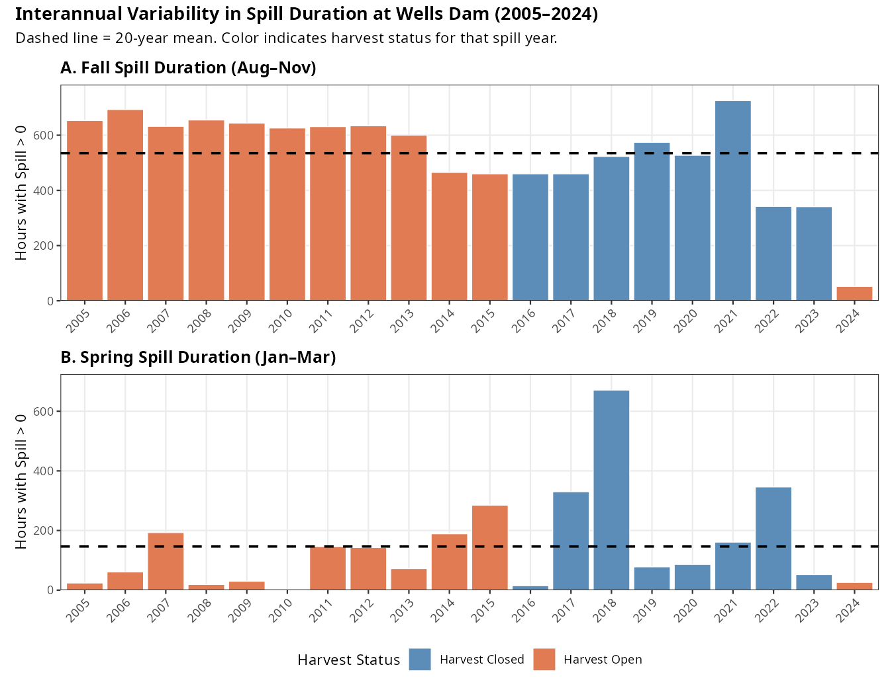
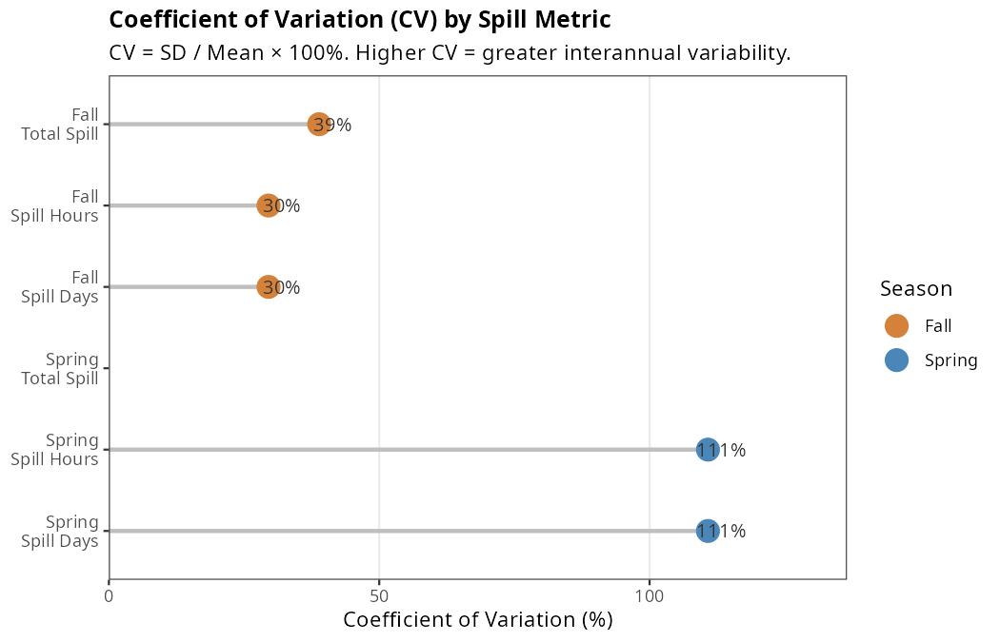
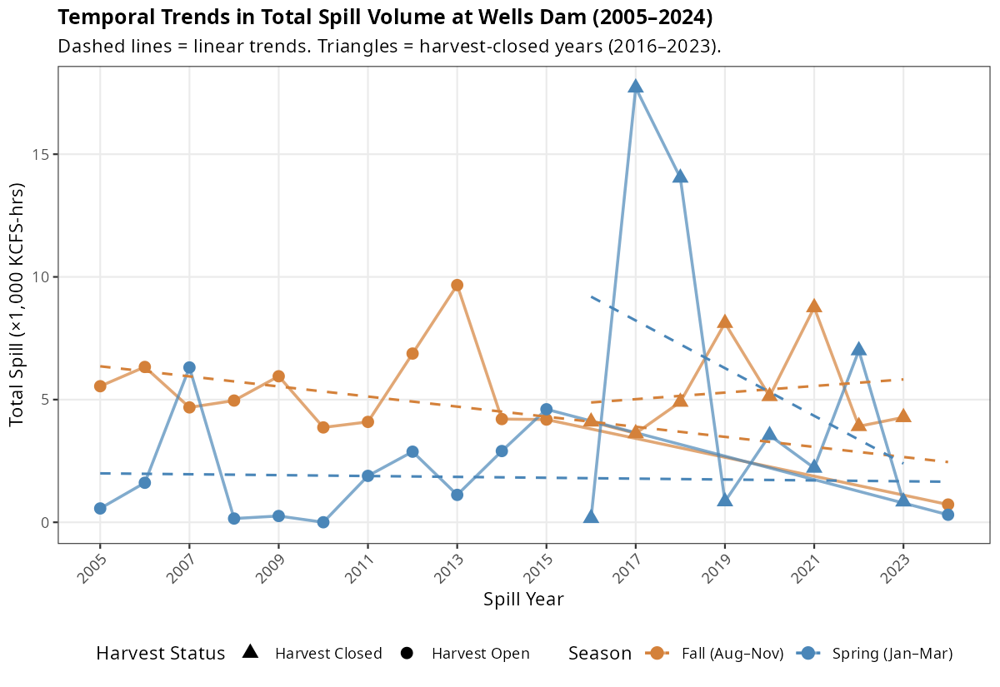

# Interannual Variability in Spill Metrics at Wells Dam (2005–2024)

## Steelhead Overshoot Analysis — Supplementary Spill Characterization

---

## 1. Overview

Seasonal dam spill at Wells Dam was characterized using three metrics for two time windows: cumulative spill volume (KCFS-hours), spill duration (hours with spill > 0), and spill days (days with any spill), each calculated for the fall steelhead arrival window (August 1–November 30) and the spring holding window (January 1–March 31). Spill years were assigned using a June 1 cutoff, pairing each fish with the fall conditions present during its arrival at Wells Dam and the spring conditions present during its holding period the following winter.

This document describes the interannual variability in these metrics across the 20-year study period, compares the two seasonal windows, and explains how the Bayesian hierarchical analysis model accounts for this variability in its inference about spill effects on steelhead downstream return probability.

---

## 2. Summary Statistics

**Table 1. Descriptive statistics for spill metrics at Wells Dam (2005–2024)**

| Metric | Mean | SD | Min (Year) | Max (Year) | CV (%) |
|--------|------|----|------------|------------|--------|
| Fall Total Spill (KCFS-hrs) | 5,195 | 2,021 | 724 (2024) | 9,667 (2013) | 39% |
| Fall Spill Hours | 535 | 158 | 52 (2024) | 725 (2021) | 30% |
| Fall Spill Days | 22 | 7 | 2 (2024) | 30 (2021) | 30% |
| Spring Total Spill (KCFS-hrs) | 3,448 | 4,738 | <1 (2010) | 17,709 (2017) | 137% |
| Spring Spill Hours | 146 | 162 | 1 (2010) | 671 (2018) | 111% |
| Spring Spill Days | 6 | 7 | 0 (2010) | 28 (2018) | 111% |

*CV = Coefficient of Variation (SD / Mean × 100%). Higher CV indicates greater interannual variability.*

---

---

## 3. Interannual Variability in Fall Spill (Aug–Nov)

### 3.1 Volume (Total Spill)

Fall cumulative spill volume ranged from 724 KCFS-hours in 2024 to 9,667 KCFS-hours in 2013—a 13-fold range (Figure 1A). The coefficient of variation (CV) was 39%, indicating moderate interannual variability. Most years fell within 3,000–7,000 KCFS-hours, with 2013 and 2021 as clear high-spill outliers and 2024 as an exceptionally low-spill year. The mean over the 20-year period was 5,195 KCFS-hours.

### 3.2 Duration (Spill Hours and Days)

Fall spill duration was somewhat less variable than total volume (CV = 30%). Duration ranged from 52 hours in 2024 to 725 hours in 2021. Because spill volume and duration are closely related in this season, fall SpillHours and fall TotalSpill are highly correlated with one another—but they capture slightly different aspects of the spill regime (intensity vs. duration).

### 3.3 Temporal Pattern

Fall spill showed no significant temporal trend across the study period (slope = −65 KCFS-hrs/year, p = 0.42). Variation appears largely driven by annual hydrology rather than a directional change in dam operations. The anomalously low 2024 fall spill (724 KCFS-hours, less than 15% of the 20-year mean) stands out as an extreme departure from typical conditions.

---

## 4. Interannual Variability in Spring Spill (Jan–Mar)

### 4.1 Volume (Total Spill)

Spring cumulative spill volume exhibited dramatically greater interannual variability than fall spill, with a CV of 137%—more than three times the fall CV. Volume ranged from essentially zero (1 KCFS-hour in 2010) to 17,709 KCFS-hours in 2017 (Figure 1B). This enormous range is driven by a bimodal pattern: a cluster of high-spill years (2017, 2018; both >14,000 KCFS-hours) associated with the harvest closure period, and many years with minimal spring spill (<2,000 KCFS-hours).

The two highest spring spill years (2017 and 2018) were nearly five times the 20-year mean of 3,448 KCFS-hours and reflect large snowpack and runoff conditions that produced substantial mandatory spill under FCRPS biological opinion requirements. Years 2010 and 2016 had near-zero spring spill, likely reflecting early season conditions where minimal water was available for non-power spill.

### 4.2 Duration (Spill Hours and Days)

Spring spill duration mirrored the volume pattern (CV = 111%). Duration ranged from 1 hour in 2010 to 671 hours in 2018. In contrast to fall, where Wells Dam spills during most hours of the season, spring spill is concentrated in a subset of years and hours driven by hydrology. In the near-zero spring spill years, fish may experience almost no spill during their holding period.

### 4.3 Temporal Pattern

Spring spill showed no significant temporal trend (slope = +166 KCFS-hrs/year, p = 0.38), though the two peak years (2017–2018) occur in the latter portion of the study period. This partly reflects the coincidence of high-precipitation years with the harvest closure period rather than a true directional trend.

---

## 5. Comparison Between Fall and Spring

### 5.1 Relative Variability

Spring spill is consistently more variable than fall spill across all three metrics:

- **Total spill CV**: Fall 39% vs. Spring 137%
- **Spill hours CV**: Fall 30% vs. Spring 111%

This difference reflects fundamentally different hydrological drivers. Fall spill at Wells Dam is relatively constrained by late-summer/early-fall hydropower operations and residual snowmelt, producing moderate and fairly consistent spill volumes. Spring spill is strongly governed by snowpack and February/March runoff, which varies dramatically from year to year in the Upper Columbia Basin.

### 5.2 Seasonal Independence

Fall and spring spill metrics within the same spill year are essentially uncorrelated (Pearson r = −0.19 for total spill; r = −0.11 for spill hours; Figure 3). A year with high fall spill does not reliably predict whether that same year will have high or low spring spill. This near-independence confirms that the two seasons are driven by different hydrological processes and that they provide genuinely distinct information in the models.

### 5.3 Absolute Scale Differences

Fall and spring seasons also differ substantially in average spill intensity. The fall window (122 days) produces roughly 50% more total cumulative spill on average than the spring window (90 days): 5,195 vs. 3,448 KCFS-hours. However, in peak spring years (2017, 2018), spring total spill exceeded fall by more than 3-fold.

---

## 6. Year-by-Year Spill Context

The figures below illustrate the full interannual pattern. Several notable years warrant specific attention:

- **2010**: Near-zero spring spill (1 KCFS-hr), below-average fall spill. This was the highest-count year (286 fish), so the near-zero spring value has outsized influence on standardization.
- **2013**: Highest fall spill volume (9,667 KCFS-hrs)—nearly double the 20-year mean.
- **2017–2018**: Consecutive record-high spring spill years (17,709 and 14,037 KCFS-hrs), coinciding with the harvest closure and very small sample sizes (16 and 11 fish respectively).
- **2021**: Highest fall spill duration (725 hours), though total volume was moderate.
- **2024**: Exceptionally low fall spill (724 KCFS-hrs), the lowest in the study period by a wide margin.

---

## 7. How the Model Accounts for Spill Variability

### 7.1 Standardization Before Model Entry

Prior to model fitting, all spill metrics were standardized to have mean = 0 and standard deviation = 1 (i.e., converted to z-scores). Figure 4 shows the standardized values for all six metrics across years.

 This serves two purposes. First, it places metrics with very different units and scales (KCFS-hours vs. days vs. hours) on a common, interpretable scale so that β_spill coefficients are comparable across models. Second, it prevents numerical instability in the Stan/HMC sampler when values span several orders of magnitude, as spring total spill does. Figure 4 shows the standardized values for all six metrics across years.

A practical consequence of standardization is that the change in log-odds of downstream return associated with a **one-standard-deviation increase** in spill. Because fall and spring spill have very different SDs (fall TotalSpill SD = 2,021 KCFS-hrs; spring TotalSpill SD = 4,738 KCFS-hrs), the same β_spill value corresponds to very different absolute changes in raw spill. For example, a β_spill of 0.10 applied to fall TotalSpill represents a response to ~2,000 KCFS-hrs of additional spill, while the same coefficient applied to spring TotalSpill represents a response to ~4,700 KCFS-hrs.

### 7.2 Year-Level Random Intercepts

The model includes year-specific random intercepts (α_j), estimated via partial pooling across all 20 spill years:

$$\alpha_j \sim \text{Normal}(\mu_\alpha, \sigma_\alpha)$$

These random intercepts absorb all year-to-year variation in the baseline probability of downstream return that is **not explained by spill or harvest exposure**. This is critical given the substantial interannual variability in spill metrics: if a year with extremely high spring spill also had high downstream return rates for unrelated reasons (e.g., low fish density, favorable temperature), the random intercept captures that coincidental association rather than attributing it spuriously to spill.

The estimated standard deviation of year random effects ranged from σ = 0.49 to 0.66 across the six models—a substantial amount of unexplained variation on the logit scale. This confirms that factors beyond spill and harvest exposure drive year-to-year differences in return rates, and that the random intercept structure is doing meaningful work.

### 7.3 Handling the High-Variability Spring Window

The extreme variability in spring spill creates a challenging estimation environment. The two years with by far the highest spring spill (2017: z = +3.0; 2018: z = +2.3) both fall within the harvest closure period (2016–2023) and have very small sample sizes (16 and 11 fish). This means that:

1. The model must separate the effect of spring spill from the effect of harvest closure in years 2017–2018, relying on the within-year composition (harvest-exposed vs. non-exposed fish) and on other harvest-closure years with lower spring spill to identify the harvest effect.
2. Small sample sizes in the high-spring-spill years increase uncertainty in the year random effects for those years, which propagates appropriately into wider posterior uncertainty for the spring spill coefficient.

The resulting spring spill estimates (β ≈ 0.03–0.09; 95% HDI spanning zero in all three metrics) reflect this uncertainty. The model correctly conveys that the data do not provide strong evidence for a spring spill effect, partly because the most informative spring spill contrasts involve small-sample years with potential confounding.

### 7.4 The Weak Spill Coefficient in Context

The near-zero spill effects estimated by the model should be interpreted against the backdrop of the substantial spill variability documented here. Fall TotalSpill ranged 13-fold and spring TotalSpill ranged over 12,000-fold across the study period. Despite this wide dynamic range—providing ample statistical leverage to detect a spill effect if one existed—neither seasonal metric produced a consistent, credible nonzero coefficient. The one exception (Fall SpillHours: β = −0.30, 95% HDI excluding zero) was not replicated by other fall metrics and likely reflects collinearity or confounding specific to the SpillHours metric rather than a genuine biological effect.

This makes the null spill finding relatively robust: the large interannual variation in spill metrics means the models had substantial power to detect a spill effect, yet none was found. In contrast, harvest exposure—a factor with a clear on/off structure but much smaller between-fish within-year variation—dominated the model estimates with an effect 7–10 times larger in absolute magnitude than any spill coefficient.

### 7.5 Prior Influence and Regularization

Weakly informative Normal(0, 1) priors were placed on both spill and harvest coefficients. On the logit scale, a coefficient of 1.0 corresponds to an odds ratio of e ≈ 2.7, and a coefficient of 2.0 corresponds to OR ≈ 7.4. The Normal(0, 1) prior is broad enough to allow large effects but provides mild regularization toward zero, which is appropriate for spill effects where the biological literature does not provide strong prior information about direction or magnitude. The estimated harvest coefficient (β ≈ −2.3) clearly overcomes this prior, while spill coefficients remain close to zero—consistent with the prior providing modest regularization for parameters where data support is weak.

---

## 8. Summary

The 20-year record of spill at Wells Dam is characterized by:

1. **Moderate interannual variability in fall spill** (CV ≈ 30–39%), with most years producing 3,000–7,000 KCFS-hours of total spill and a 13-fold range between the lowest (2024) and highest (2013) years.

2. **Extreme interannual variability in spring spill** (CV ≈ 111–137%), driven by snowpack-dependent hydrology. Two outlier years (2017, 2018) account for a disproportionate share of the total spring spill across the study period.

3. **No significant temporal trend** in either season over 2005–2024.

4. **Near-zero correlation between fall and spring spill** (r ≈ −0.19), confirming that the two seasons are driven by independent hydrological processes.

The Bayesian hierarchical model accounts for this variability through standardization of spill inputs, year-level random intercepts that absorb unexplained interannual variation, and weakly informative priors that allow the data—rather than prior assumptions—to determine the magnitude and direction of spill effects. Despite the wide dynamic range of spill conditions observed over the study period, neither seasonal window produced a consistent credible effect on steelhead downstream return probability. Harvest exposure, operating at the individual fish level, dominated the results with an effect size roughly an order of magnitude larger than any estimated spill coefficient.

---

*Analysis conducted March 2026*

*Data source: Columbia River DART hourly spill records, Wells Dam (WELW), 2000–2024*

*Statistical software: R 4.3.2 with ggplot2, tidyverse, patchwork*
